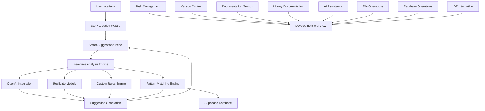

# AI-Powered Smart Suggestions Feature Architecture

## Overview
This document outlines the architecture for implementing the AI-powered Smart Suggestions feature in the Tale Forge platform. It details how all 9 MCP tools would be utilized in the development workflow to create a comprehensive, efficient development process.

## System Architecture Diagram



## Component Architecture

### 1. Frontend Components

#### Smart Suggestions Panel
- React component that displays AI-generated suggestions
- Collapsible panel that appears alongside the story creation wizard
- Real-time updates as users fill out forms
- Accept/dismiss functionality for suggestions

#### Real-time Analysis Engine (Frontend)
- Client-side analysis of story inputs
- Debouncing to prevent excessive API calls
- Caching of recent suggestions
- User preference tracking

### 2. Backend Services

#### Suggestion Generation Service
- Supabase Edge Function that orchestrates suggestion generation
- Integrates with OpenAI and Replicate APIs
- Applies custom rules for child safety and educational value
- Pattern matching against successful stories in the database

#### Custom Rules Engine
- Validates suggestions against safety guidelines
- Ensures age-appropriate content
- Applies educational value filters
- Custom rule management API

#### Pattern Matching Engine
- Analyzes successful stories in the database
- Identifies common patterns and structures
- Generates template-based suggestions
- Machine learning model for pattern recognition

## Database Schema

### Suggestions Table
```sql
CREATE TABLE smart_suggestions (
    id UUID PRIMARY KEY DEFAULT gen_random_uuid(),
    user_id UUID REFERENCES users(id),
    story_id UUID REFERENCES stories(id),
    suggestion_type TEXT NOT NULL,
    suggestion_text TEXT NOT NULL,
    context_data JSONB,
    is_accepted BOOLEAN DEFAULT false,
    created_at TIMESTAMP WITH TIME ZONE DEFAULT NOW(),
    updated_at TIMESTAMP WITH TIME ZONE DEFAULT NOW()
);
```

### Suggestion Templates Table
```sql
CREATE TABLE suggestion_templates (
    id UUID PRIMARY KEY DEFAULT gen_random_uuid(),
    template_name TEXT NOT NULL,
    suggestion_type TEXT NOT NULL,
    template_content TEXT NOT NULL,
    target_age_group TEXT,
    genre TEXT,
    is_active BOOLEAN DEFAULT true,
    created_at TIMESTAMP WITH TIME ZONE DEFAULT NOW(),
    updated_at TIMESTAMP WITH TIME ZONE DEFAULT NOW()
);
```

### User Preferences Table
```sql
CREATE TABLE user_suggestion_preferences (
    id UUID PRIMARY KEY DEFAULT gen_random_uuid(),
    user_id UUID REFERENCES users(id) UNIQUE,
    preferred_suggestion_types TEXT[],
    dismissed_suggestions UUID[],
    created_at TIMESTAMP WITH TIME ZONE DEFAULT NOW(),
    updated_at TIMESTAMP WITH TIME ZONE DEFAULT NOW()
);
```

## MCP Tools Integration Workflow

### 1. Research Phase (ref-tools, context7)
- **ref-tools**: Search for best practices in AI-powered UI suggestions
- **context7**: Find React component examples for real-time suggestion panels
- **openai**: Get explanations of complex architectural concepts

### 2. Planning Phase (taskmaster)
- **taskmaster**: Create and manage development tasks
- Break down feature into manageable subtasks
- Track progress and dependencies
- Set priorities and deadlines

### 3. Development Phase (filesystem, ide, supabase)
- **filesystem**: Create and modify component files
- **ide**: Get real-time code suggestions and error detection
- **supabase**: Database schema updates and migration management

### 4. AI Integration Phase (replicate, openai)
- **replicate**: Integrate specialized AI models for content generation
- **openai**: Implement natural language processing for suggestions
- **context7**: Find examples of AI integration patterns

### 5. Testing Phase (ide, supabase)
- **ide**: Debugging and testing tools
- **supabase**: Test data management and query optimization

### 6. Documentation Phase (ref-tools)
- **ref-tools**: Search for documentation resources
- **ref-tools**: Read relevant technical documentation
- Update internal documentation

### 7. Deployment Phase (github)
- **github**: Version control and code review
- **github**: Automated testing and deployment workflows
- **github**: Release management

## API Endpoints

### Get Suggestions
```
POST /functions/v1/generate-suggestions
{
  "storyData": { ... },
  "suggestionTypes": ["character", "plot", "setting"],
  "userId": "uuid"
}
```

### Accept Suggestion
```
POST /functions/v1/accept-suggestion
{
  "suggestionId": "uuid",
  "storyId": "uuid"
}
```

### Dismiss Suggestion
```
POST /functions/v1/dismiss-suggestion
{
  "suggestionId": "uuid",
  "userId": "uuid"
}
```

## Security Considerations

1. All AI-generated content must pass through safety filters
2. User data is encrypted and access-controlled
3. API keys are stored securely in environment variables
4. Rate limiting to prevent abuse of AI services
5. Content moderation for user-generated suggestions

## Performance Optimization

1. Caching of frequently requested suggestions
2. Asynchronous processing of suggestion generation
3. Database indexing for quick pattern matching
4. Client-side caching to reduce API calls
5. Lazy loading of suggestion components

## Scalability Considerations

1. Microservices architecture for independent scaling
2. Database sharding for large user bases
3. CDN for static assets
4. Load balancing for API endpoints
5. Queue-based processing for AI model requests