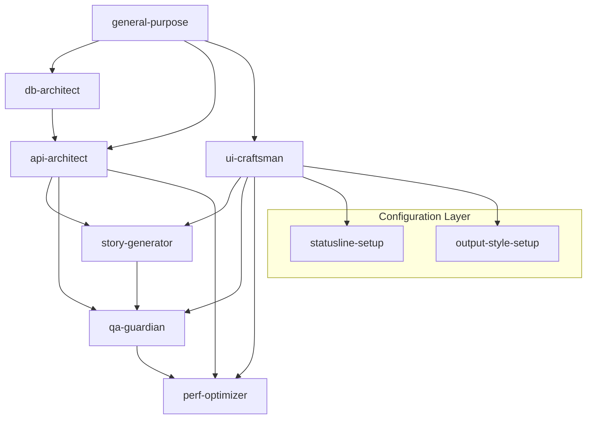

# 🤖 AGENT COORDINATION MATRIX & ORCHESTRATION STRATEGIES

## 📊 Agent Specialization Deep Analysis

### Primary Agents (Core Development)
| Agent | Domain | Tools Access | Coordination Level | Primary Role |
|-------|--------|-------------|-------------------|--------------|
| **general-purpose** | Research & Orchestration | All tools (*) | **SUPREME** | Master coordinator, complex research |
| **ui-craftsman** | Frontend & Design | Design, Components, UI | **HIGH** | React specialist, design systems |
| **story-generator** | Content Creation | AI, Database, Content | **HIGH** | Story workflows, content validation |
| **qa-guardian** | Quality Assurance | Testing, Code Quality | **HIGH** | Testing automation, quality validation |
| **perf-optimizer** | Performance & Analytics | Monitoring, BI, Analytics | **HIGH** | Performance tuning, business intelligence |
| **db-architect** | Database & Data | Supabase, Migrations | **HIGH** | Data architecture, schema design |
| **api-architect** | Backend & APIs | APIs, Edge Functions | **HIGH** | Backend development, integrations |

### Support Agents (Configuration)  
| Agent | Domain | Tools Access | Coordination Level | Primary Role |
|-------|--------|-------------|-------------------|--------------|
| **statusline-setup** | Interface Config | Interface Setup | **MEDIUM** | Configuration specialist |
| **output-style-setup** | Styling Systems | Design Systems | **MEDIUM** | Style configuration |

## 🔄 AGENT COORDINATION MATRIX

### High-Synergy Agent Pairs
```
┌─────────────────┬─────────────────┬─────────────────────────────────┐
│ Agent 1         │ Agent 2         │ Coordination Strategy           │
├─────────────────┼─────────────────┼─────────────────────────────────┤
│ db-architect    │ api-architect   │ Sequential: Schema → API Design │
│ story-generator │ ui-craftsman    │ Parallel: Content + UI         │
│ qa-guardian     │ perf-optimizer  │ Sequential: Testing → Optimize  │
│ ui-craftsman    │ perf-optimizer  │ Iterative: UI → Performance    │
│ api-architect   │ story-generator │ Sequential: API → Content       │
│ general-purpose │ ALL AGENTS      │ Supervisory: Research → Direct │
└─────────────────┴─────────────────┴─────────────────────────────────┘
```

### Agent Workflow Chains


## 🎯 COORDINATION STRATEGIES

### Strategy 1: Sequential Handoff Pattern
**Use Case**: Database → API → Frontend development
```yaml
Workflow: "Full Stack Feature Development"
Sequence:
  1. general-purpose: 
     - Research requirements and best practices
     - Create comprehensive implementation plan
  2. db-architect:
     - Design database schema based on requirements
     - Create migrations and data models
     - Hand off schema documentation
  3. api-architect:
     - Build APIs based on database schema
     - Implement business logic and validation
     - Create API documentation and tests
  4. ui-craftsman:
     - Build frontend components consuming APIs
     - Implement user interface and interactions
     - Create component documentation
  5. qa-guardian:
     - Test entire feature stack
     - Validate integration points
     - Create automated test suites
  6. perf-optimizer:
     - Optimize database queries and API performance
     - Implement monitoring and analytics
     - Create performance benchmarks

Handoff Triggers:
  - Schema design complete → API development starts
  - API endpoints functional → Frontend development starts  
  - UI components complete → Testing phase starts
  - Tests passing → Performance optimization starts
```

### Strategy 2: Parallel Collaboration Pattern  
**Use Case**: Story creation with simultaneous content and UI development
```yaml
Workflow: "Story Feature Development"
Parallel Tracks:
  Track A - Content:
    1. story-generator: Create story content and logic
    2. api-architect: Build story serving APIs
  Track B - Interface:  
    1. ui-craftsman: Design story reader interface
    2. output-style-setup: Configure story styling
  
Synchronization Points:
  - Week 1: Requirements alignment meeting
  - Week 2: API contract agreement  
  - Week 3: Integration testing
  - Week 4: Performance optimization

Integration Agent: qa-guardian
  - Coordinates testing between both tracks
  - Validates integration points
  - Ensures quality standards
```

### Strategy 3: Iterative Refinement Pattern
**Use Case**: Performance optimization with feedback loops
```yaml
Workflow: "Performance Enhancement Cycle"  
Iteration Cycle:
  1. perf-optimizer: Identify performance bottlenecks
  2. ui-craftsman: Optimize frontend performance
  3. api-architect: Optimize backend performance  
  4. db-architect: Optimize database queries
  5. qa-guardian: Validate improvements
  6. perf-optimizer: Measure and analyze results
  
Loop Condition: Continue until performance targets met
Feedback Mechanism: Real-time performance monitoring
Exit Criteria: Performance benchmarks achieved
```

### Strategy 4: Supervisory Coordination Pattern
**Use Case**: Complex feature development with general-purpose oversight
```yaml
Workflow: "Supervised Development Sprint"
Supervisor: general-purpose
  - Conducts initial research and planning
  - Assigns work to specialized agents
  - Monitors progress and coordination
  - Resolves conflicts and bottlenecks
  - Ensures quality and consistency

Specialized Agents: Execute under supervision
  - Receive clear requirements and constraints
  - Report progress and issues to supervisor
  - Coordinate through supervisor for dependencies
  - Follow established patterns and standards

Coordination Meetings:
  - Daily: Progress check-ins with supervisor
  - Weekly: Cross-agent collaboration review
  - Sprint End: Comprehensive results review
```

## 🔧 SPECIFIC COORDINATION WORKFLOWS

### Workflow 1: Tale-Forge Story Creation Pipeline
```yaml
Name: "Complete Story Development Pipeline"
Duration: 2-3 weeks
Participants: 6 agents

Phase 1: Foundation (Days 1-3)
  general-purpose:
    - Research target audience and story requirements
    - Analyze competitor story platforms
    - Create comprehensive story development plan
    → Hands off to story-generator

  db-architect (parallel):
    - Design story data storage schema
    - Plan user progress tracking system  
    - Create migration scripts
    → Hands off to api-architect

Phase 2: Core Development (Days 4-10)  
  story-generator:
    - Generate story content using AI models
    - Create character profiles and plot structures
    - Validate content for target audience
    → Hands off to ui-craftsman (content) + api-architect (data)

  api-architect:
    - Build story serving APIs
    - Implement progress tracking endpoints
    - Create content management system
    → Hands off to ui-craftsman (API contracts)

  ui-craftsman (receives from both):
    - Design story reader interface
    - Build interactive story components
    - Implement progress tracking UI
    → Hands off to qa-guardian

Phase 3: Integration & Quality (Days 11-15)
  qa-guardian:
    - Test story creation workflow end-to-end
    - Validate story reading experience
    - Create automated test suites
    → Hands off to perf-optimizer

  perf-optimizer:
    - Optimize story loading performance
    - Implement analytics tracking
    - Monitor user engagement metrics
    → Final validation

Success Criteria:
  - Stories load in under 2 seconds
  - User engagement > 5 minutes average
  - Zero critical bugs in testing
  - All accessibility standards met
```

### Workflow 2: UI Component System Development
```yaml
Name: "Design System & Component Library"  
Duration: 1-2 weeks
Participants: 4 agents

Phase 1: Setup (Days 1-2)
  general-purpose:
    - Research design system best practices
    - Analyze Tale-Forge brand requirements
    - Create component specification document
    → Hands off to ui-craftsman + output-style-setup

  output-style-setup (parallel):
    - Configure base styling system
    - Set up design tokens and variables
    - Create style guide foundation
    → Hands off to ui-craftsman

Phase 2: Development (Days 3-7)
  ui-craftsman:
    - Build reusable component library
    - Implement design system patterns
    - Create component documentation
    → Hands off to qa-guardian

  statusline-setup (parallel):  
    - Configure interface status systems
    - Set up user feedback components
    - Create notification systems
    → Integration with ui-craftsman

Phase 3: Validation (Days 8-10)
  qa-guardian:
    - Test component functionality
    - Validate accessibility compliance  
    - Create component test suite
    → Hands off to perf-optimizer

  perf-optimizer:
    - Optimize component rendering
    - Measure bundle size impact
    - Create performance benchmarks
    → Final optimization

Handoff Protocols:
  - Component specifications → Implementation
  - Styling foundation → Component development
  - Component completion → Testing phase
  - Testing validation → Performance optimization
```

### Workflow 3: Database Performance Optimization
```yaml
Name: "Database Architecture & Performance"
Duration: 1 week  
Participants: 4 agents

Phase 1: Analysis (Days 1-2)
  perf-optimizer:
    - Analyze current database performance
    - Identify slow queries and bottlenecks
    - Create optimization roadmap
    → Hands off to db-architect + api-architect

Phase 2: Optimization (Days 3-5)
  db-architect:
    - Optimize database schema design
    - Add proper indexes and constraints
    - Implement query optimizations
    → Hands off to api-architect

  api-architect:
    - Optimize API query patterns
    - Implement efficient data fetching
    - Add database connection pooling
    → Hands off to qa-guardian

Phase 3: Validation (Days 6-7)  
  qa-guardian:
    - Test database performance improvements
    - Validate data integrity
    - Create performance regression tests
    → Hands off to perf-optimizer

  perf-optimizer:
    - Measure performance improvements
    - Set up monitoring and alerts
    - Create performance dashboards
    → Final validation

Performance Targets:
  - Query response time < 100ms
  - Database CPU usage < 70%
  - Zero data integrity issues
  - 99.9% uptime reliability
```

## 🚀 IMPLEMENTATION GUIDE

### Step 1: Agent Deployment Setup
```bash
# Deploy agents with specialized roles
claude task --agent general-purpose "Initialize Tale-Forge orchestration analysis"
claude task --agent ui-craftsman "Analyze current UI component architecture"  
claude task --agent story-generator "Evaluate story creation workflow requirements"
claude task --agent qa-guardian "Assess current testing infrastructure"
claude task --agent perf-optimizer "Baseline current application performance"
claude task --agent db-architect "Review database schema and performance"
claude task --agent api-architect "Audit API architecture and patterns"
```

### Step 2: Coordination Channel Setup
```bash
# Set up coordination through TaskMaster MCP
taskmaster create-project "Agent Coordination Hub"
taskmaster add-team-members --agents "general-purpose,ui-craftsman,story-generator,qa-guardian,perf-optimizer,db-architect,api-architect"

# Configure handoff triggers
taskmaster create-workflow "Sequential Development Pipeline"
taskmaster create-workflow "Parallel Story Development"  
taskmaster create-workflow "Performance Optimization Cycle"
```

### Step 3: Workflow Execution Monitoring
```bash
# Monitor agent coordination through multiple MCP servers
sentry configure-agent-monitoring --agents all
linear create-epic "Agent Coordination Workflows"
notion create-workspace "Agent Collaboration Hub"
```

### Step 4: Success Metrics
```yaml
Coordination Effectiveness:
  - Handoff delay time < 1 hour
  - Inter-agent communication clarity > 95%
  - Workflow completion rate > 90%
  - Quality standards maintenance > 99%

Development Velocity:
  - Feature delivery time reduction > 40%
  - Bug rate reduction > 60%  
  - Code review time reduction > 50%
  - Documentation completeness > 95%

Quality Improvements:
  - Test coverage increase > 80%
  - Performance optimization > 30%
  - User satisfaction increase > 25%
  - Technical debt reduction > 40%
```

This coordination matrix ensures that all 9 specialized agents work together seamlessly, with clear handoff protocols, parallel collaboration strategies, and comprehensive monitoring for optimal development velocity and quality.